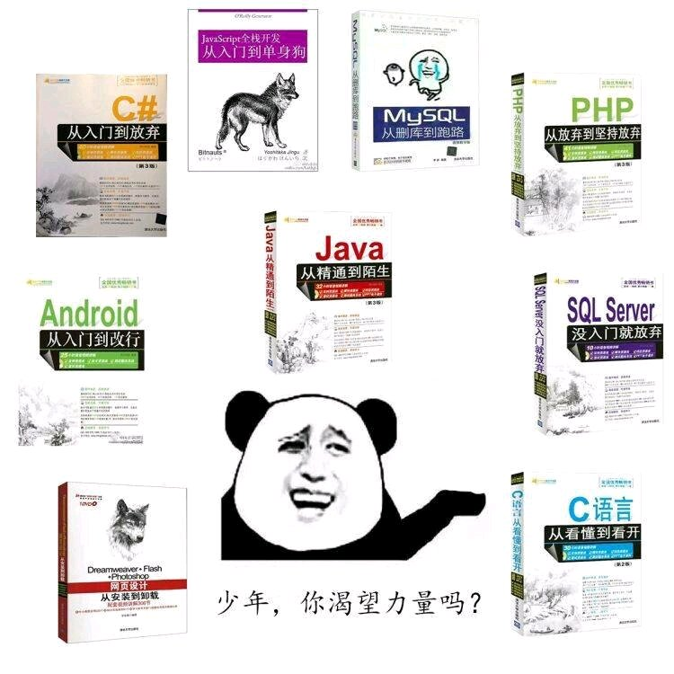

# 环境要求
需要python3，建议使用python3.8(及以上)。
## 模块使用
- requests
# 作用
下载一些高中课本资源
# 运行
打开main.py运行
# 更新
每次更新将在以下地址首发：
- [github](https://github.com/Wang-Haolong/Preservation_of_teaching_materials)
- [码云](https://gitee.com/wang_hao_long/Preservation_of_teaching_materials)

By Wang Haolong